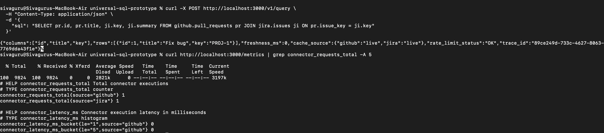

# Observability Snapshot

The attached screenshot demonstrates request-level observability in the Universal SQL prototype.

- A cross-source query (GitHub + Jira) was executed successfully.
- Each connector execution increments a Prometheus counter:
  `connector_requests_total{source}`.
- Execution latency is captured via a histogram:
  `connector_latency_ms`.
- Each query is assigned a `trace_id`, enabling correlation across logs and metrics.

This confirms that the query execution path is observable and debuggable, even in a thin-slice prototype.

