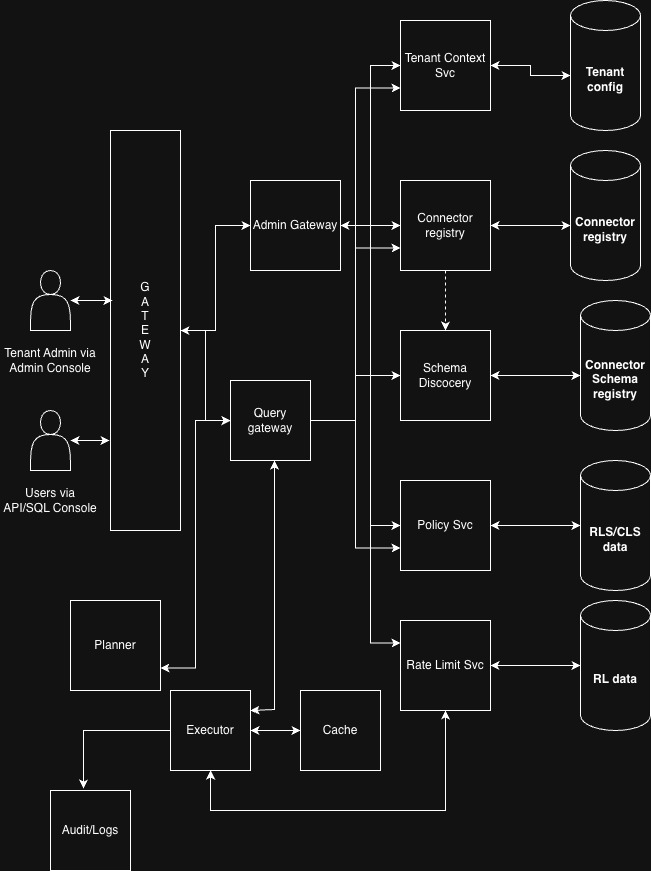

# System Architecture: Universal SQL Platform

## Overview

The Universal SQL platform is designed with a **control-plane–first architecture**, where administrators configure tenants, connectors, policies, and budgets before any user query is executed.

The system cleanly separates:
- **Control Plane** – governance, planning, metadata, and policy
- **Data Plane** – execution, connector access, caching
- **Edge / Gateway** – authentication, routing, and request shaping

This separation enables strong multi-tenancy, flexible isolation, and support for both shared and dedicated deployments.

---

## High-Level Architecture Diagram



---

## Actors & Entry Points

### Tenant Administrator
- Uses the **Admin Console**
- Onboards tenants
- Configures connectors, schemas, policies, rate limits, and freshness

### End Users
- Access the platform via **API / SQL Console**
- Execute SQL queries
- Operate strictly within administrator-defined boundaries

All traffic enters the platform through a shared **Gateway**, which performs authentication and request routing.

---

## Gateway Layer

### Gateway
The Gateway is the unified entry point for both administrators and users.

Responsibilities:
- Authentication (OIDC / tokens)
- Tenant identification
- Request routing to:
  - **Admin Gateway** for configuration flows
  - **Query Gateway** for query execution flows

The Gateway itself is stateless and does not execute queries.

---

## Control Plane

The Control Plane owns **governance, planning, and decision-making**.  
It determines *what is allowed*; the data plane later enforces these decisions.

### Admin Gateway
- Receives administrative requests
- Writes configuration into control-plane services
- Never executes user queries

### Tenant Context Service
- Resolves tenant identity
- Provides tenant-scoped configuration such as:
  - Isolation mode
  - Encryption keys
  - Default budgets

Backed by:
- **Tenant Config Store**

### Connector Registry
- Stores enabled connectors per tenant
- Tracks connector versions and capabilities
- Associates credentials and budgets

Backed by:
- **Connector Registry Store**

### Schema Discovery
- Introspects enabled connectors
- Discovers objects, fields, and capabilities
- Normalizes schemas into a SQL-like model

Backed by:
- **Connector Schema Registry**

### Policy Service
- Stores and evaluates:
  - Row-Level Security (RLS)
  - Column-Level Security (CLS)
- Compiles policies into query-time predicates

Backed by:
- **RLS / CLS Policy Store**

### Rate Limit Service
- Maintains rate-limit budgets per:
  - Tenant
  - Connector
  - User
- Decides:
  - Whether a query can run synchronously
  - Whether it must be throttled or deferred

Backed by:
- **Rate Limit Data Store**

---

## Data Plane

The Data Plane is responsible for **execution only**.  
It does not make governance decisions.

### Query Gateway
- Receives governed requests from the Gateway
- Fetches required control-plane metadata:
  - Tenant context
  - Schemas
  - Policies
  - Rate-limit decisions
- Produces an executable query plan

### Planner
- Parses SQL
- Applies schema resolution
- Pushes down predicates and projections
- Produces a physical execution plan

### Executor
- Executes the plan
- Coordinates connector calls
- Applies joins, projections, and filters
- Interacts with cache and rate-limit enforcement

### Cache
- Stores short-lived results
- Used for:
  - Freshness control
  - Reducing external API calls
- Always tenant-scoped

### Audit / Logs
- Records:
  - Cross-system access
  - Query metadata
  - Policy enforcement decisions
- Used for compliance and debugging

---

## Single-Tenant and Multi-Tenant Deployment Modes

The platform supports **multiple deployment tiers without changing application code**.  
Isolation strength is determined by **deployment topology**, not business logic.

### Tier 1: Shared Everything (Logical Isolation Only)

**Use case**
- Early-stage
- Cost-sensitive
- Low regulatory requirements

**Deployment**
```
One cluster
One namespace
All tenants share runtime
```

**Isolation**
- Logical only
- Enforced via `tenantId` in control and data plane

---

### Tier 2: Shared Cluster, Isolated Namespaces (Default)

**Use case**
- Most SaaS customers
- Strong isolation with operational efficiency

**Deployment**
```
One cluster
One namespace per tenant
```

**Isolation**
- Namespace-level isolation
- Tenant-scoped secrets, caches, rate limits
- Shared binaries, shared cluster control plane

**Key property**
> Stateless logic is shared; state and blast radius are isolated.

---

### Tier 3: Single-Tenant (Dedicated)

**Use case**
- Large enterprises
- Regulated environments
- Strict compliance and data residency

**Deployment**
```
One cluster per tenant
One namespace
```

**Isolation**
- Dedicated control plane
- Dedicated data plane
- Dedicated databases, secrets, network

**Key property**
> The tenant receives their own platform slice.

---

## Deployment Mode Diagram (Conceptual)

```
Global Entry (DNS / Load Balancer)
              |
      Tenant Resolution Layer
              |
     ┌────────┴─────────┐
     |                  |
 Tier 2 Tenant        Tier 3 Tenant
 (Shared Cluster)     (Dedicated Cluster)
     |                  |
 Namespace A          Cluster A
 Namespace B          Cluster B
```

---

## Key Design Principles

- Tenant context is always resolved first
- Control plane decides, data plane enforces
- Isolation increases by changing deployment, not code
- Tier 2 and Tier 3 may share entry points, never execution
- Every cross-system access is auditable

---

## Why This Matters

This architecture allows the platform to:
- Scale to hundreds of tenants
- Support thousands of connectors
- Offer enterprise-grade isolation when required
- Avoid code forks or special-case logic

---

## Next Section

The next section describes the **end-to-end user query lifecycle**, showing how a SQL query moves from the Query Gateway through control-plane planning into data-plane execution.
